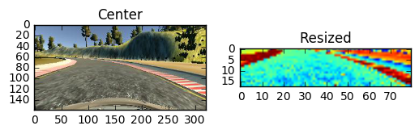
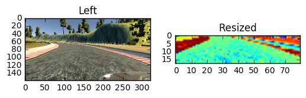
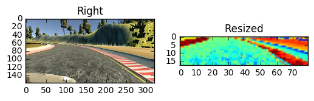

# Udacity Self-Driving Car Nanodegree
# Behavioral Cloning Project - 2nd Submission

## Overview

In the first submission, I did all of the work on iPython notebook. 

In this second submission, I created standalone python scripts to do all of the deep learning training.

This iPython notebook describes the function of each python script involved in the project.

Follow this link to watch the video **https://www.youtube.com/watch?v=7YA6JL4vcw4**.

---

There are **3** python scripts: **preprocess.py**, **model.py**, and **drive.py**.

## preprocess.py
This python script imports the raw image data and resizes them.

I resized the image because image contains unnecessary background noises such as sky, river, and trees.

I decided to remove them and reduced the size of the image by **25%**, then I used only one channel from each image. I found that the image data do not have to have a lot of pixels when training the model. I found reducing the size by 25% and using just one channel were more efficient in terms of time and space.

I saved them as **features** and saved the data of steering angels as **labels**.

Then, I splitted the data into **train** and **validation**, and saved them as **frontcamera.pickle** file.

## model.py
The main purpose of this script is to train the model using the data saved from the above python script.

First, it imports the **pickle** file from the local drive and train the data using model that I built.

The detail of the model can be found in the script.

When the training is done, the model and weights are saved as **model.json** and **model.h5**.

## drive.py
This is the python script that receives the data from the Udacity program, predicts the steering angle using the deep learning model, and send the throttle and the predicted angles back to the program.

Since the images were reshaped and normalized during training, the image from the program is reshaped and normalized just as in **preprocess.py** and **model.py**

---

## Preprecessing

As mentioned briefly above, the images are loaded from the local drive and reshaped by the function called **load_image**.

Below are the original images from center, left, and right cameras and reshaped images at the right of each original image.


```python
### Import data
import argparse
import os
import csv
import base64
import numpy as np
import matplotlib.pyplot as plt

folder_path = "/Users/wonjunlee/Downloads/udacity/Self-Driving-Car-Nanodegree/CarND-BehavioralCloning-P3"
label_path = "{}/driving_log.csv".format(folder_path)

data = []
with open(label_path) as F:
    reader = csv.reader(F)
    for i in reader:
        data.append(i) 

print("data imported")
```

    data imported


```python
def load_image(data_line, j):
    img = plt.imread(data_line[j].strip())[65:135:4,0:-1:4,0]
    lis = img.flatten().tolist()
    return lis

i = 0
for j in range(3):
    plt.subplot(121)
    img = plt.imread(data[i][j].strip())
    plt.imshow(img)
    if j == 0:
        plt.title("Center")
    elif j == 1:
        plt.title("Left")
    elif j == 2:
        plt.title("Right")
    plt.subplot(122)
    a = np.array(load_image(data[i], j)).reshape(1, 18, 80, 1)
    # a = load_image(data[img_num])
    print(a.shape)
    plt.imshow(a[0,:,:,0])
    plt.title("Resized")
    plt.show()
del(a)
```

    (1, 18, 80, 1)





    (1, 18, 80, 1)





    (1, 18, 80, 1)





I had total **18899** items each contained three images from different angles: center, left, and right. So, there are total **18899 x 3 = 56697** images I reshaped and used for training.

---

## Training

Below is the summary of the model I implemented to train the data.

        ___________________________________________________________________________________________________
        Layer (type)                     Output Shape          Param #     Connected to                     
        ====================================================================================================
        convolution2d_1 (Convolution2D)  (None, 16, 78, 16)    160         convolution2d_input_1[0][0]      
        ____________________________________________________________________________________________________
        activation_1 (Activation)        (None, 16, 78, 16)    0           convolution2d_1[0][0]            
        ____________________________________________________________________________________________________
        convolution2d_2 (Convolution2D)  (None, 14, 76, 8)     1160        activation_1[0][0]               
        ____________________________________________________________________________________________________
        activation_2 (Activation)        (None, 14, 76, 8)     0           convolution2d_2[0][0]            
        ____________________________________________________________________________________________________
        convolution2d_3 (Convolution2D)  (None, 12, 74, 4)     292         activation_2[0][0]               
        ____________________________________________________________________________________________________
        activation_3 (Activation)        (None, 12, 74, 4)     0           convolution2d_3[0][0]            
        ____________________________________________________________________________________________________
        convolution2d_4 (Convolution2D)  (None, 10, 72, 2)     74          activation_3[0][0]               
        ____________________________________________________________________________________________________
        activation_4 (Activation)        (None, 10, 72, 2)     0           convolution2d_4[0][0]            
        ____________________________________________________________________________________________________
        maxpooling2d_1 (MaxPooling2D)    (None, 5, 36, 2)      0           activation_4[0][0]               
        ____________________________________________________________________________________________________
        dropout_1 (Dropout)              (None, 5, 36, 2)      0           maxpooling2d_1[0][0]             
        ____________________________________________________________________________________________________
        flatten_1 (Flatten)              (None, 360)           0           dropout_1[0][0]                  
        ____________________________________________________________________________________________________
        dense_1 (Dense)                  (None, 16)            5776        flatten_1[0][0]                  
        ____________________________________________________________________________________________________
        activation_5 (Activation)        (None, 16)            0           dense_1[0][0]                    
        ____________________________________________________________________________________________________
        dense_2 (Dense)                  (None, 16)            272         activation_5[0][0]               
        ____________________________________________________________________________________________________
        activation_6 (Activation)        (None, 16)            0           dense_2[0][0]                    
        ____________________________________________________________________________________________________
        dense_3 (Dense)                  (None, 16)            272         activation_6[0][0]               
        ____________________________________________________________________________________________________
        activation_7 (Activation)        (None, 16)            0           dense_3[0][0]                    
        ____________________________________________________________________________________________________
        dropout_2 (Dropout)              (None, 16)            0           activation_7[0][0]               
        ____________________________________________________________________________________________________
        dense_4 (Dense)                  (None, 1)             17          dropout_2[0][0]                  
        ====================================================================================================
        Total params: 8023

---
# Conclusion

I found that the whole image can confuse the model due to unncessary background noises such as tries, skies, etc. I decided to cut those unncessary pixels and reduced the size by 25%. I only used red channel of the image because I assumed that red channel contains the better information for identifying the road and lanes than green and blue channels. As a result, the size of the image was 18 x 80 x 1. 

In my model, I used 4 convolutional layers with 1 max pooling layer, and 3 more dense layers after flatten the matrix. For each convolutional layer, I decreased the channel size by half. When the size of the channel became 2 in the fourth convolutional layer, I applied max pooling with dropout with 25%. After flatten the matrix, the size of features became 360. I used dense layers with 16 features 4 times. Each **epoch** took about **100** seconds and I used **10 epoches** to train the data. As a result, the car drove by itself without popping onto the edges or out of the edges.

The interesting thing I noticed was even though the model allowed the car to drive itself, the accuracy was only about **58%**. So the accuracy did not have to be high for car to drive autonomously. I believe that to increase the accuracy, I would need more data set and more epoches.


```python

```
